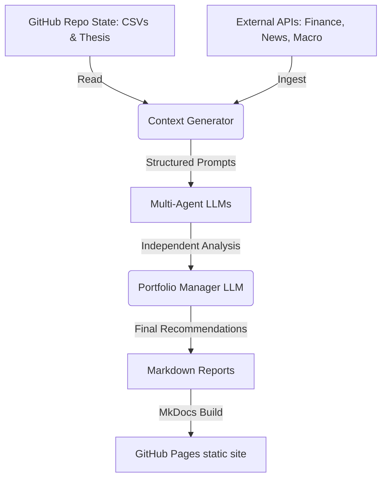

# AlphaOracle Architecture

## Overview
AlphaOracle is an automated, AI-driven stock analysis and portfolio management system. It operates on a daily schedule via GitHub Actions, aggregating market data, generating context, synthesizing independent LLM opinions, and publishing actionable trading recommendations to a GitHub Pages static site.

## System Components

### 1. The Knowledge Base (State & Inputs)
Stored directly in the GitHub repository:
*   `portfolio.csv`: Current positions, cost basis, quantities, and cash balance.
*   `watchlist.csv`: Tickers categorized by sector, ETF, or specific trade setup.
*   `thesis/`: A directory of Markdown files detailing the investment philosophy.
    *   `macro_view.md`: Long-term economic outlook (e.g., inflation expectations, interest rates).
    *   `sectors.md`: Key verticals of interest (e.g., AI, biotech, defense).
    *   `seasonality_rules.md`: Historical market tendencies to be aware of.

### 2. Data Ingestion Engine (Python)
Executed daily via GitHub Actions:
*   **Price & Volume Data:** End-of-day data for SPY, watchlist tickers, and key indices (VIX, DXY, 10-Year Yield).
*   **Technical Analysis Engine:** Calculates key indicators (RSI, MACD, Moving Averages, Bollinger Bands, ATR) using `pandas_ta`.
*   **News & Sentiment Aggregator:** Fetches top financial headlines and specific news for the watchlist.
*   **Macro Calendar Events:** Checks for upcoming Fed meetings, CPI releases, or major earnings.

### 3. Context Generation Engine
Formats the raw ingested data and the Knowledge Base into highly structured Markdown prompts tailored for the LLMs. 
*   It performs hardcoded evaluations, like determining the current "Market Regime" (e.g., Bullish Volatile, Bearish Trend) based on objective metrics (VIX level, SPY vs 200 SMA) rather than relying on LLMs to calculate it.
*   It builds the *Historical Accountability Loop*, feeding the AI its past predictions and the actual subsequent market moves.

### 4. Multi-Agent LLM Processing Pipeline
The core intelligence layer. Uses multiple diverse LLMs (via a library like `litellm`) prompted with specific personas:
*   **The Risk Manager (e.g., Gemini 1.5 Pro):** Focuses entirely on downside protection, looking for bearish divergence, high volatility setups, and macro risks.
*   **The Technical Analyst (e.g., DeepSeek):** Ignores the news; evaluates purely based on price action, moving averages, support/resistance, and volume.
*   **The Macro Strategist (e.g., Claude 3.5 Sonnet):** Focuses on interest rates, currency pairs, global markets, and geopolitical news.

### 5. Synthesis & Portfolio Manager (The Final LLM)
A highly capable model (e.g., GPT-4o or Claude 3.5 Sonnet) takes the outputs from the three agents, the original context, and the `portfolio.csv`.
*   **Task:** Debate disagreements between the agents, weigh them against the user's `thesis/`, and output a definitive, actionable plan.
*   **Output:** A structured JSON or strict Markdown table containing:
    *   **Action:** Buy/Sell/Hold/Options Strategy
    *   **Ticker/Asset**
    *   **Conviction Level:** High/Medium/Low
    *   **Timeframe**
    *   **Justification**

### 6. Presentation Layer
*   **Static Site Generator:** MkDocs (with Material theme).
*   **Content:** The final synthesized report is rendered as the daily homepage. Individual agent reports and raw data logs are available as sub-pages.
*   **Deployment:** GitHub Pages hosts the static site, updated automatically by the GitHub Action.

## Infrastructure Diagram

